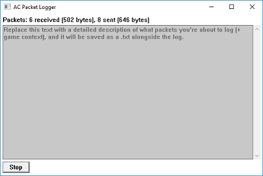
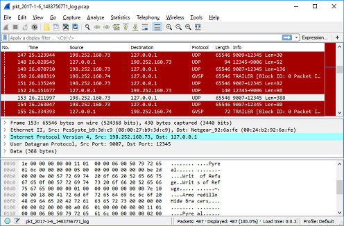

# aclog

An Asheron's Call 1 & 2 packet logger for the latest clients as of Jan 6, 2017.

### Usage:

Place 'msxml4.dll' in your Asheron's Call 1/2 folder next to 'acclient.exe' or 'ac2client.exe'. The logger will automatically load a UI window each time you start AC1/AC2. Packet logs and user descriptions are saved to .pcap and .txt files in the same folder.

If the dll does not load, try uninstalling the (now obsolete) MSXML 4.0 from your system, as it may load its own dll instead of the packet logger dll. Alternatively, for AC1 only, you can rename the dll to 'acpl.dll' and it should load.

### The UI:



### Opening a .pcap file in Wireshark:



### More info:

This builds 'msxml4.dll' that is automatically loaded by either 'acclient.exe' or 'ac2client.exe' when placed in the same folder.

The logging dll acts as a middleman between AC's network functions and winsock sendto/recvfrom in order to log packet data. It also spawns a UI window on startup to enable users to view capture statistics and start/stop new capture files. The UI includes an optional textbox for describing the current capture's goal and game context for later analysis.

Packet logs are in standard .pcap format, which can be opened in Wireshark and other tools. Note that not all network headers are fully filled out - i.e. the local address is always reported as 127.0.0.1:12345. Timing of packets uses the first packet captured in the log as time-zero.

The optional description text for each packet log is stored in .txt format next to each .pcap.

Packet logs and user descriptions are all timestamped in both the filename ("pkt_YYYY-MM-DD_TIMESTAMP") and the file content itself.

# Building

Clone this repo.

#### Use [CMake](https://cmake.org/download):

**Either GUI:**

1. Source path = full path to aclog

2. Build path = full path to aclog/build

3. [Configure]

4. [Generate]

**Or command line:**
```
cd aclog
mkdir build
cd build
cmake ..
```

#### Use [Visual Studio](https://www.visualstudio.com/vs/cplusplus):
Build using the CMake-generated solution: aclog/build/aclog.sln